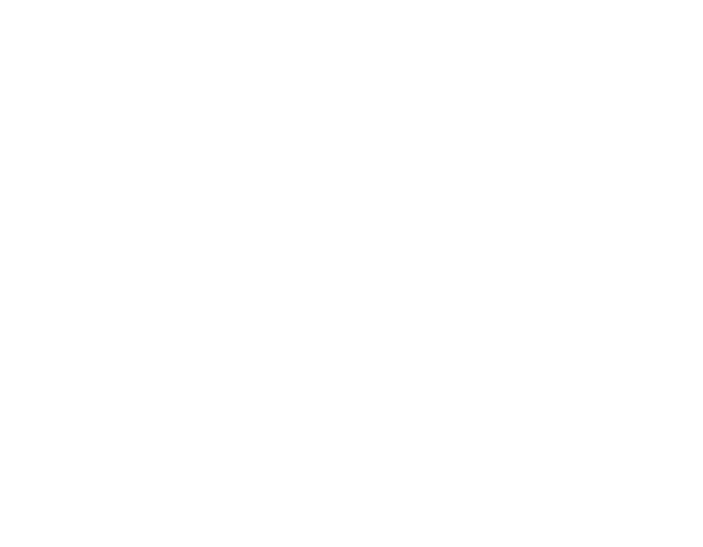
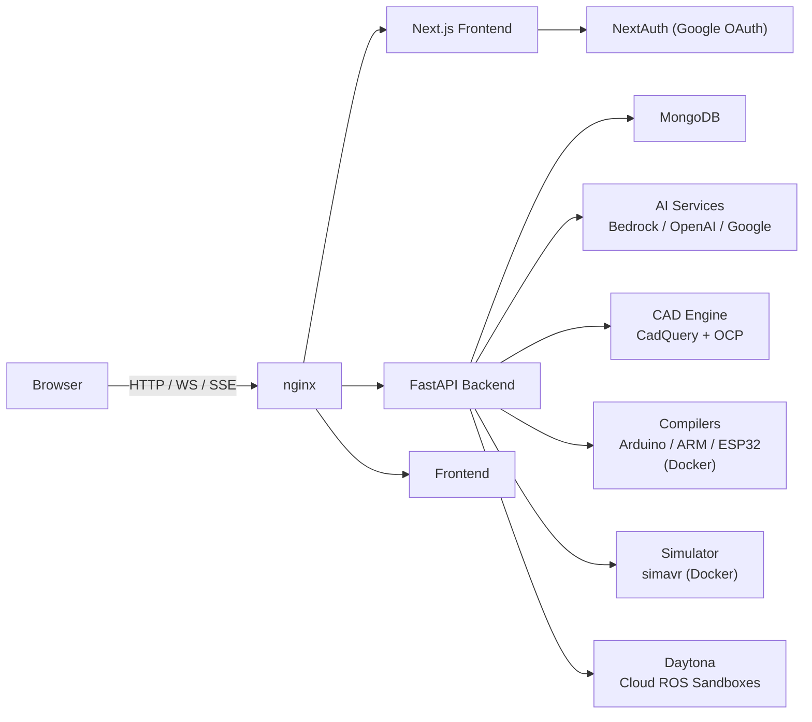
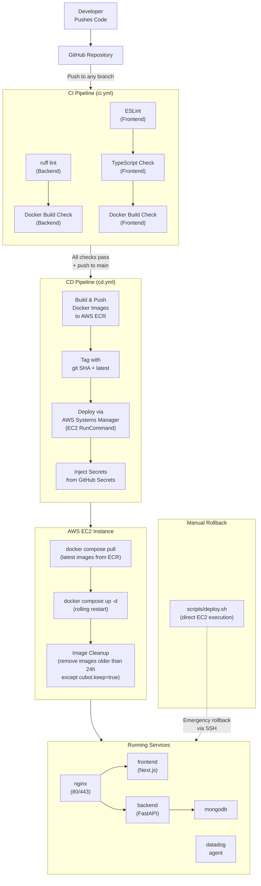

<p align="center">
  
</p>

<h1 align="center">CuBot IDE</h1>

<p align="center">
  A web-based IDE for embedded systems and robotics development.<br/>
  Code editor · Hardware simulator · AI assistant · CAD studio · Visual block programming — all in one platform.
</p>

---

## Architecture



---

## Deployment Workflow



---

## Features

### Code Editor (IDE)

The IDE is built around Monaco Editor — the same engine that powers VS Code.

**File Management**
- VSCode-style file explorer with tree view and drag-and-drop
- Create, rename, and delete files and folders
- Multi-tab editing with unsaved change tracking
- Supports C, C++, `.ino`, Python, Markdown, JSON, and more
- Keyboard shortcuts mirroring VS Code defaults

**Project Types**
- **Embedded** — Arduino, ESP32, and TI ARM projects with hardware-specific toolchains
- **ROS** — Linux-based projects backed by cloud Daytona sandboxes

**Compilation**
- Compiler runs in an isolated Docker container per toolchain
- Supported targets: Arduino (avr-gcc), TI ARM (arm-none-eabi-gcc), ESP32 (xtensa)
- Compile output streams to an integrated terminal panel
- Errors are highlighted and can be explained by the AI assistant

**Serial Monitor**
- Connect to physical hardware over USB serial
- Configurable baud rate
- Send and receive raw UART data in real time

**Firmware Upload**
- Flash compiled `.hex` / `.bin` to a connected device
- Upload progress tracked step-by-step in a dialog

---

### AI Assistant

The chat sidebar is embedded directly in the IDE and powered by AWS Bedrock (default), with optional OpenAI and Google GenAI backends.

**Chat Modes**
- **Vibe** — Conversational coding help. Ask questions, get explanations, debug logic
- **Plan** — Structured multi-step code generation. The AI produces a plan and executes each step sequentially, streaming results

**Context Awareness**
- Select files from the explorer to inject them as context into any message
- The AI reads your entire open file and uses it to give grounded answers
- Compile errors are automatically forwarded to the AI for explanation

**Providers**
- AWS Bedrock (default, configurable model ID)
- Google GenAI
- OpenAI

---

### CAD Studio

A natural language interface for generating 3D models using CadQuery — a Python-based parametric CAD library.

**Generation Modes**

| Mode | Description |
|------|-------------|
| Single-Shot | Fast generation for simple shapes — one prompt, one script |
| Planned | Multi-step decomposition for complex assemblies — breaks the design into parts, executes each with a reflect-and-fix loop |

**Planned Pipeline (Layered Architecture)**
1. `cad_planner.py` decomposes the request into named parts with dependencies
2. `cad_part_executor.py` generates and runs each part's CadQuery script in sequence
3. Each step streams progress over SSE — the UI renders a live plan panel
4. Failed parts trigger an automatic reflect-and-fix retry

**Output**
- Live 3D preview rendered from a base64-encoded STL
- Download the `.stl` file for use in any CAD tool or slicer
- View the generated CadQuery Python source code

---

### Visual Block Programming

A drag-and-drop node editor (powered by XYFlow) for programming robot arm motions without writing code.

**Available Block Types**

| Block | Description |
|-------|-------------|
| Start / End | Program entry and exit points |
| For Loop | Repeat a block sequence N times |
| While | Repeat while a condition holds |
| If / Else | Conditional branching |
| Move Position | Move arm to an (x, y, z) Cartesian target |
| Move Joint | Set individual joint angles directly |
| Get Position | Read current arm position into a variable |
| Delay | Pause execution for N milliseconds |

**3D Arm Visualization**
- Live Three.js rendering of the robot arm
- Updates in real time as the arm state changes over WebSocket
- Visualize the effect of each block before running on hardware

**Execution**
- Block programs are serialized and sent to the backend
- The backend converts them to executable code and dispatches to the arm
- Real-time status streamed back over `/ws/arm/status` WebSocket

**Inverse Kinematics**
- Built-in IK solver translates Cartesian targets to joint angles
- Used by Move Position blocks automatically

---

### Simulator

Run compiled Arduino firmware in a browser-connected software emulator — no hardware required.

**How It Works**
1. Upload a compiled `.hex` file (output from the compile step)
2. The backend launches `simavr` inside Docker targeting ATmega328p
3. A WebSocket streams real-time pin state changes and serial output back to the browser

**Observable Outputs**
- Digital pin HIGH/LOW transitions with timestamps
- `Serial.print()` / `Serial.println()` output
- All events streamed as JSON over WebSocket

---

### ROS / Daytona Sandbox Integration

For ROS projects, CuBot IDE provisions a cloud-hosted Linux workspace via the Daytona API.

**Workspace Lifecycle**
- Create a Daytona workspace tied to a project
- File sync in both directions (IDE files ↔ sandbox filesystem)
- Workspace persists until explicitly deleted

**Terminal Access**
- xterm.js terminal connected directly to the Daytona sandbox shell
- Run ROS nodes, `colcon build`, `ros2 launch`, etc. from the browser
- Full Linux environment with ROS pre-installed

**File Sync**
- Push individual files or the entire project to the sandbox
- Pull changes made in the sandbox back into the IDE

---

### Custom Component Library

Define reusable sensors and actuators to use across projects.

- Specify component type (sensor or actuator), pins, and configurable properties
- Attach a custom icon and rendering script
- Simulate component behavior in isolation via the component simulation service
- Components appear as options in the wiring diagram tool

---

### Wiring Diagram Generator

Automatically generate circuit diagrams from component selections.

- Pick components from the library
- The backend generates an SVG showing physical wiring connections
- Export the diagram for documentation or hardware assembly

---

### Authentication

- Google OAuth via NextAuth.js
- JWT tokens verified by the FastAPI backend on every request
- Session state managed client-side, no cookies shared with the API

---

## Tech Stack

| Layer | Technologies |
|-------|--------------|
| **Frontend** | Next.js 16 (App Router), React 19, TypeScript 5 |
| **UI** | Shadcn/ui, Radix primitives, Tailwind CSS v4 |
| **Editor** | Monaco Editor |
| **3D / Graphics** | Three.js, React Three Fiber, WebGL (PixelSnow) |
| **Visual Programming** | XYFlow |
| **Terminal** | xterm.js with WebGL addon |
| **Backend** | FastAPI, uvicorn, Python 3.11+ |
| **Database** | MongoDB 7.0 (Motor async driver) |
| **AI / LLM** | AWS Bedrock, Google GenAI, OpenAI |
| **CAD** | CadQuery 2.4.0, OCP 7.7.2 |
| **Compilers** | Docker (avr-gcc, arm-none-eabi-gcc, xtensa) |
| **Simulation** | simavr (ATmega328p), Docker |
| **Cloud Sandboxes** | Daytona API |
| **Auth** | NextAuth.js, Google OAuth, JWT |
| **Observability** | Datadog APM, Logs, Tracing |
| **Infra** | Docker Compose, nginx, AWS EC2, AWS ECR |
| **CI/CD** | GitHub Actions |

---

## Project Structure

```
cubot-ide/
├── frontend/               # Next.js application
│   ├── app/                # App Router pages
│   │   ├── page.tsx        # Landing page
│   │   ├── dashboard/      # Project dashboard
│   │   ├── ide/            # Code editor
│   │   ├── cad/            # CAD studio
│   │   ├── blocks/         # Block editor
│   │   └── simulator/      # Firmware simulator
│   ├── components/
│   │   ├── ide/            # Editor, chat, compile, serial, upload, terminal
│   │   ├── blocks/         # Block nodes, arm visualization
│   │   ├── cad/            # CAD chat, plan panel, STL viewer
│   │   └── ui/             # Shadcn primitives (40+ components)
│   ├── contexts/           # ProjectContext (global state)
│   ├── hooks/              # WebSocket hooks, navigation
│   └── lib/
│       ├── api/            # HTTP + WebSocket client layer
│       └── simulator/      # AVR simulation utilities
├── backend/                # FastAPI application
│   ├── routes/             # HTTP + WebSocket route handlers
│   ├── services/           # Business logic (AI, CAD, compile, IK, etc.)
│   ├── models/             # Pydantic data models
│   ├── schemas/            # Request / response validation
│   └── core/               # Config, database, auth
├── compilers/              # Compiler Docker image definitions
│   ├── arduino/
│   └── ti-arm/
├── scripts/
│   └── deploy.sh           # Manual deploy / rollback helper
├── nginx/                  # Reverse proxy config
├── .github/workflows/      # CI and CD pipelines
└── docker-compose.yml      # Service orchestration
```

---

## Environment Variables

| Variable | Description |
|----------|-------------|
| `DOMAIN` | Public domain (e.g. `ide.example.com`) |
| `NEXTAUTH_SECRET` | NextAuth signing secret |
| `GOOGLE_CLIENT_ID` | Google OAuth client ID |
| `GOOGLE_CLIENT_SECRET` | Google OAuth client secret |
| `MONGO_USER` / `MONGO_PASSWORD` | MongoDB credentials |
| `AWS_REGION` | AWS region for Bedrock and ECR |
| `AWS_ACCESS_KEY_ID` | AWS access key |
| `AWS_SECRET_ACCESS_KEY` | AWS secret key |
| `BEDROCK_MODEL_ID` | Bedrock model identifier |
| `DAYTONA_API_KEY` | Daytona cloud sandbox API key |
| `SECRET_KEY` | FastAPI JWT signing key |
| `ALLOWED_ORIGINS` | CORS allowed origins |
| `DD_API_KEY` | Datadog API key |
| `DD_SITE` / `DD_ENV` / `DD_VERSION` | Datadog configuration |

---

## Running Locally

```bash
# Clone the repo
git clone https://github.com/your-org/cubot-ide.git
cd cubot-ide

# Copy and fill in environment variables
cp .env.example .env

# Start all services
docker compose up -d

# Frontend available at http://localhost:3000
# Backend API at http://localhost:8000
```

For development with hot reload:

```bash
# Backend
cd backend
pip install -e ".[dev]"
uvicorn main:app --reload

# Frontend
cd frontend
npm install
npm run dev
```
